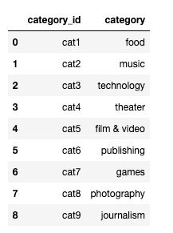
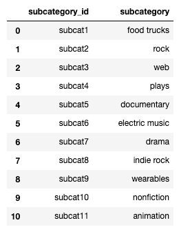
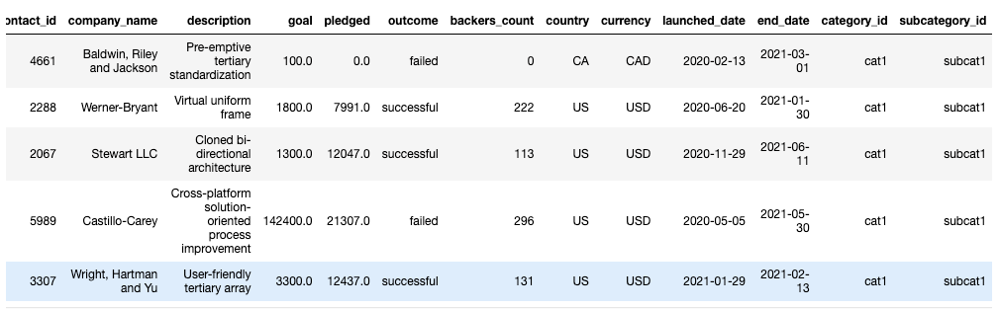
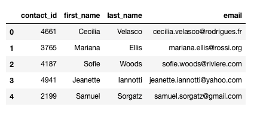
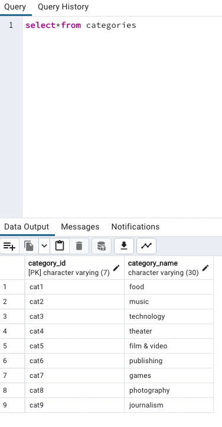
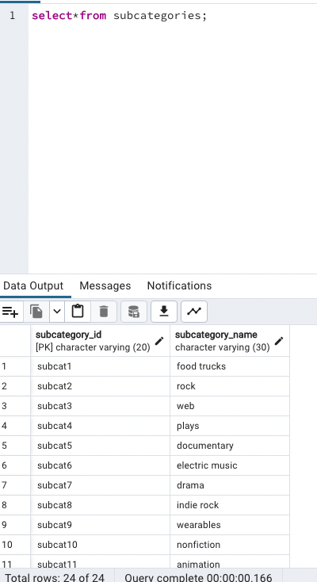
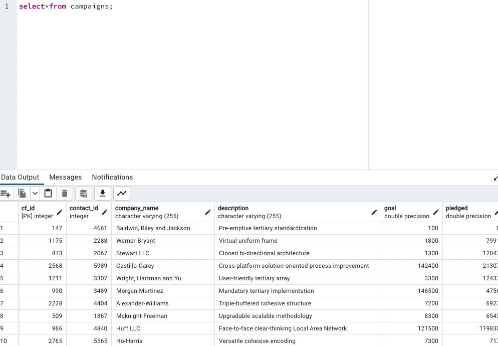
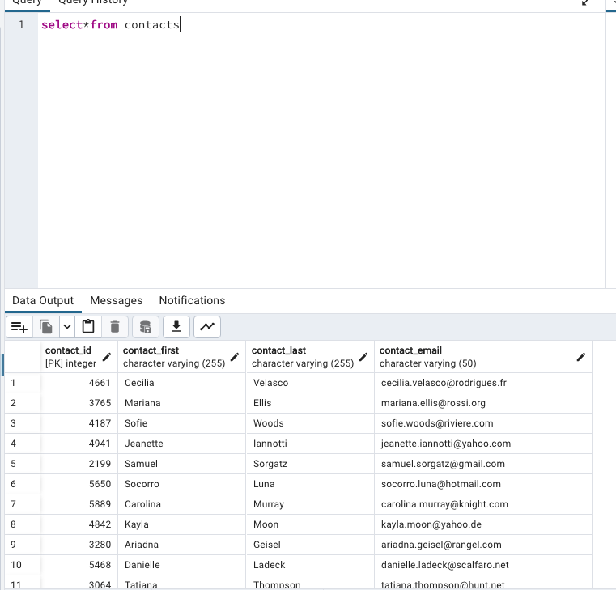

# Crowdfunding_ETL
Project 2

## Background
This project builds an ETL (Extract, Transform, Load) pipeline using Python, Pandas, and Python dictionary methods or regular expressions. The goal is to extract and transform the data, followed by creating four CSV files. These CSV files will then be used to generate an Entity-Relationship Diagram (ERD) and a table schema. Finally, the transformed data will be uploaded into a Postgres database.

## Technologies Used
- Python
- Pandas
- Postgres SQL

## Project Steps

1. Extract and Transform Data:
   - Use Python and either Python dictionary methods or regular expressions to extract and transform the data.
2. Create CSV Files:
   - After transforming the data, create four CSV files to store the processed data.
3. Generate ERD and Table Schema:
   - Utilize the CSV file data to create an Entity-Relationship Diagram (ERD) that visually represents the relationships between different entities.
   - Create a table schema based on the transformed data, outlining the structure of the tables.
4. Upload Data to Postgres Database:
   - Take the transformed data from the CSV files and upload it into a Postgres database.

### Create the Category and Subcategory DataFrames
Extracted and transformed the crowdfunding.xlsx Excel data to create category and subcategory DataFrames with the requested columns.
* [Category CSV file](Resources/category.csv)
* Category DataFrame

* [Subcategory CSV file](Resources/subcategory.csv)
* Subcategory DataFrame

### Create the Campaign DataFrame
Extracted and transformed the crowdfunding.xlsx Excel data to create a campaign DataFrame with the requested columns.
* [Campaign CSV file](Resources/campaign.csv)
* Campaign DataFrame

### Create the Contacts DataFrame
Extracted and transformed the contacts.xlsx Excel data to create a contacts DataFrame with the requested columns.
* [Contacts CSV file](Resources/contacts.csv)
* Contacts DataFrame

### Create the Crowdfunding Database
Inspected the four CSV files, and then sketched an ERD of the tables by using QuickDBD.
* Crowdfunding ERD

Used the information from the ERD to create a table schema for each CSV file. Specified the data types, primary keys, foreign keys, and other constraints.
[crowdfunding_db_schema](crowdfunding_db_schema.sql)

Created a new Postgres database, named crowdfunding_db. Using the database schema, created the tables in the correct order to handle the foreign keys. 

Imported each CSV file into its corresponding SQL table.

Lastly, we verified that each table has the correct data by running a SELECT statement for each:
* Categories Table

 

* Subcategories table

* Campaigns table

* Contacts table

